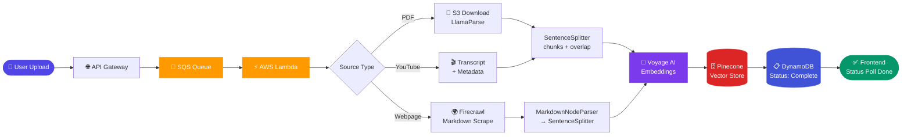
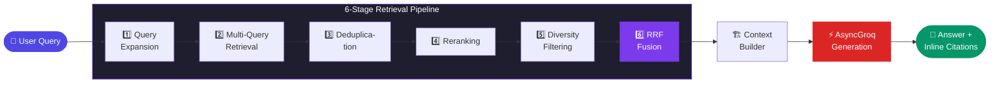
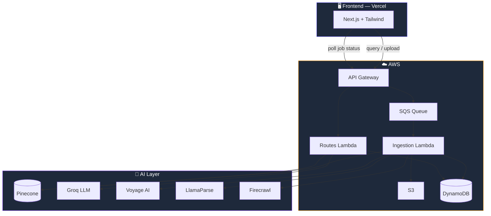

<div align="center">

# 📚 ScholarNote

### Intelligent RAG-Powered Document Chat

**Chat with any PDF, webpage, or YouTube video — and get cited, verified answers in under a second.**

[](https://www.scholarnote.studio)
[](https://github.com/Bhavesh42833)

</div>

---

## 📖 Overview

ScholarNote is a production-grade, serverless **Retrieval-Augmented Generation (RAG)** system that lets you have intelligent conversations with your documents. Upload a PDF, paste a URL, or drop a YouTube link — and within seconds you can ask questions, get inline-cited answers, and trace every response back to its exact source.

Built without any LangChain wrappers, ScholarNote uses a fully custom async Python backend orchestrating **LlamaIndex**, **Groq**, **Pinecone**, and **AWS** — delivering sub-second responses even over 40+ page documents.

### Why ScholarNote?

| Problem | ScholarNote's Solution |
|---|---|
| Slow document ingestion | Async pipeline cuts ingestion from 30s → **5s** |
| Unreliable retrieval | 6-stage pipeline cuts latency from 15s → **sub-second** |
| Hallucinated answers | Inline citations `[1][2]` with jump-to-source |
| Poor chunking quality | Markdown-aware per-source chunking + Voyage AI embeddings |
| Exam prep friction | Auto-classified question paper upload & analysis |

---

## ✨ Features

- 🗂️ **Multi-source ingestion** — PDFs, webpages (Firecrawl), YouTube transcripts
- ⚡ **Sub-second responses** — Groq inferencing engine with parallel async processing
- 📌 **Inline citations** — Every answer includes `[1]`, `[2]` references with jump-to-source
- 📝 **Question paper analysis** — Upload exam papers, auto-classify questions, retrieve answers per group
- 🔍 **6-stage retrieval pipeline** — Query expansion → deduplication → reranking → diversity filtering → RRF
- 🧩 **Markdown-aware chunking** — Per-source chunking strategies preserving document structure
- 🚫 **No framework wrappers** — Custom orchestration, full control over every pipeline stage
- 📊 **Multi-stage logging** — Per-stage timing metrics and status tracking throughout
- ☁️ **Serverless AWS deployment** — Zero idle compute, horizontal scaling via Lambda

---

## 🛠️ Tech Stack

### Frontend
<p>
  
  
  
</p>

### Backend
<p>
  
  
  
  
  
  
  
</p>

### Infrastructure
<p>
  
  
  
  
  
  
  
</p>

---

## 📁 File Structure

```
ScholarNote/
├── 📁 api/
│   └── routes.py              # FastAPI route definitions
├── 📁 ingestion/
│   ├── pipeline.py            # Staged ingestion orchestrator
│   ├── loader.py              # PDF, webpage, YouTube loaders
│   ├── tranformers.py         # Chunking & question classification
│   └── query.py              # Question paper parsing pipeline
├── 📁 retrieval/
│   ├── pipeline.py            # Retrieval orchestrator
│   ├── retrievers.py          # Parallel multi-query retrievers
│   ├── fusion.py              # RRF + citation mapping
│   └── generation.py         # Answer generation with inline citations
├── 📁 core/
│   ├── llm.py                 # AsyncGroq LLM client
│   ├── aws.py                 # S3, SQS, DynamoDB clients
│   ├── database.py            # DynamoDB job lifecycle management
│   ├── model.py               # Data models & schemas
│   ├── resources.py           # Pinecone & embedding clients
│   ├── utils.py               # Shared utilities
│   ├── logger.py              # Stage-based structured logging
│   ├── exceptions.py          # Custom exception types
│   └── exceptionHandler.py   # Global exception handling
├── ingestion_handler.py       # Lambda ingestion entry point
├── routes_handler.py          # Lambda routes entry point
├── dockerfile                 # Multi-stage Docker build
├── requirements.txt           # Python dependencies
└── README.md
```

---

## 🔄 Ingestion Pipeline

The ingestion pipeline is fully asynchronous and staged. Each source flows through **Load → Transform → Embed → Store**.



> ⚡ `asyncio.gather` fans out parallel embedding calls and concurrent document streams — cutting ingestion from **30s → 5s**

### Stage Breakdown

| Stage | What happens |
|-------|-------------|
| **Load** | PDFs pulled from S3, webpages scraped via Firecrawl, YouTube converted from transcript + metadata |
| **Transform** | PDFs → `SentenceSplitter` with overlap · Webpages → `MarkdownNodeParser` then `SentenceSplitter` · YouTube → `SentenceSplitter` with timestamps |
| **Embed** | All chunks embedded via **Voyage AI** — ~75% accuracy improvement over naive baselines |
| **Store** | Vectors upserted to Pinecone with metadata · DynamoDB updated to `complete` · Frontend stops polling |

---

## 🔍 Retrieval Pipeline

A 6-stage pipeline optimized for accuracy, speed, and full source traceability.



> ⚡ Response latency reduced from **15s → sub-second (95% reduction)**

### Stage Breakdown

| Stage | What happens |
|-------|-------------|
| **1. Query Expansion** | AsyncGroq generates multiple semantic query variants to compensate for vocabulary mismatch |
| **2. Multi-Query Retrieval** | All variants hit Pinecone in parallel via `asyncio.gather`, retrieving top-k chunks each |
| **3. Deduplication** | Duplicate chunks across query variants removed by content hash |
| **4. Reranking** | Chunks scored against original query for semantic relevance |
| **5. Diversity Filtering** | Ensures context covers multiple source sections, not just one region |
| **6. RRF Fusion** | Reciprocal Rank Fusion merges results — rewards chunks ranked highly across multiple queries |

**Answer Generation:** Fused context passed to AsyncGroq with citation-forcing prompt → `[1]`, `[2]`... inline citations. Context builder returns reference map with file name, page, timestamps, URL for jump-to-source in UI.

---

## 📋 Question Paper Pipeline


---

## 🏗️ Architecture Overview



---

## ⚙️ Setup & Installation

### Prerequisites
- Python 3.11+, Node.js 18+, Docker
- AWS account (S3, SQS, DynamoDB, Lambda)
- Pinecone, Groq, Voyage AI, LlamaCloud, Firecrawl API keys

### Backend

```bash
git clone https://github.com/Bhavesh42833/scholarnote-backend
cd scholarnote-backend
pip install -r requirements.txt
cp .env.example .env        # fill in keys
uvicorn api.routes:app --reload --port 8000
```

### Frontend

```bash
git clone https://github.com/Bhavesh42833/scholarnote-frontend
cd scholarnote-frontend
npm install
cp .env.example .env.local  # fill in API URL
npm run dev
```

---

## 🔐 Environment Variables

### Backend `.env`

```env
# AWS
AWS_ACCESS_KEY_ID=your_access_key
AWS_SECRET_ACCESS_KEY=your_secret_key
AWS_REGION=us-east-1
AWS_S3_BUCKET=your_s3_bucket
AWS_SQS_QUEUE_URL=your_sqs_queue_url
AWS_DYNAMODB_TABLE=your_dynamodb_table

# Vector Store
PINECONE_API_KEY=your_pinecone_key
PINECONE_INDEX_NAME=scholarnote

# LLM & Embeddings
GROQ_API_KEY=your_groq_key
VOYAGE_API_KEY=your_voyage_key
LLAMA_CLOUD_API_KEY=your_llamacloud_key
FIRECRAWL_API_KEY=your_firecrawl_key
```

### Frontend `.env.local`

```env
NEXT_PUBLIC_API_URL=https://your-api-gateway-url.amazonaws.com
```

---

## 🚀 Deployment

### Backend — AWS Lambda

```bash
# Build and push to ECR
docker build -t scholarnote-backend .
aws ecr get-login-password --region us-east-1 | \
  docker login --username AWS --password-stdin <account>.dkr.ecr.us-east-1.amazonaws.com
docker tag scholarnote-backend:latest <account>.dkr.ecr.us-east-1.amazonaws.com/scholarnote-backend:latest
docker push <account>.dkr.ecr.us-east-1.amazonaws.com/scholarnote-backend:latest

# Lambda entry points
# ingestion_handler.py → triggered by SQS
# routes_handler.py   → triggered by API Gateway
```

### Frontend — Vercel

```bash
npm install -g vercel
vercel --prod
```

---

## 📊 Performance

| Metric | Before | After | Improvement |
|--------|--------|-------|-------------|
| Ingestion time | 30s | 5s | **83% faster** |
| Response latency | 15s | sub-second | **95% faster** |
| Retrieval accuracy | baseline | +75% | vs naive chunking |
| Infrastructure overhead | traditional server | serverless | **60% lower** |

---

## 📄 License

MIT License — see [LICENSE](LICENSE) for details.

---

<div align="center">

Built with ❤️ by [Bhavesh Agrawal](https://www.linkedin.com/in/gameron42)

[](https://www.linkedin.com/in/gameron42)
[](https://github.com/Bhavesh42833)
[](https://www.scholarnote.studio)

⭐ **Star this repo if you found it useful!**

</div>
